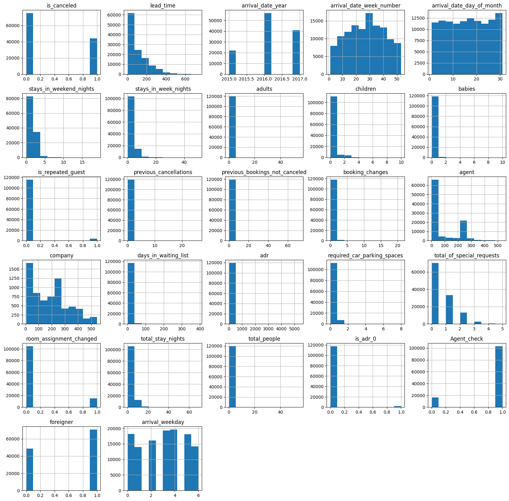
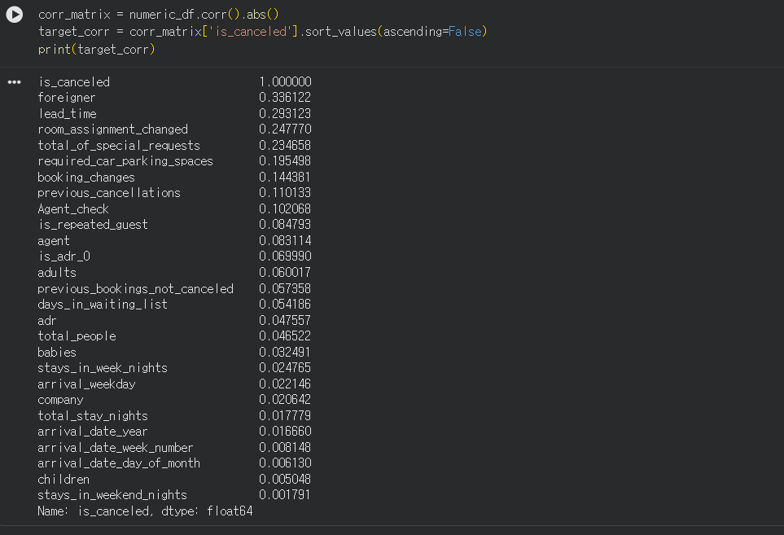

# 데이터 전처리 결과서

## 1. 데이터 출처

- 데이터셋: Hotel Booking Demand Dataset
- 출처: https://www.kaggle.com/datasets/mojtaba142/hotel-booking

---

## 2. 데이터 이해

### 2.1 데이터셋 개요

본 데이터셋은 포르투갈 리스본 지역의 **City Hotel**과 **Resort Hotel** 두 호텔의 예약 정보를 포함하고 있다.

데이터는 **2015년부터 2017년 8월까지**의 예약 기록으로 구성되어 있으며, 예약 취소 여부를 포함한 다양한 고객 및 예약 정보를 제공한다.

전체 데이터는 **10만 건 이상의 행(Row)** 과 **30개 이상의 컬럼(Column)** 으로 이루어져 있어 호텔 예약 패턴과 노쇼(No-show) 및 예약 취소 예측을 위한 분석에 활용할 수 있다.

### 2.2 컬럼 정보

| 컬럼명 | 설명 |
|--------|------|
| hotel | 호텔 유형 (Resort Hotel / City Hotel) |
| is_canceled | 예약 취소 여부 (0: 유지, 1: 취소) |
| lead_time | 예약일부터 체크인일까지의 기간 |
| arrival_date_year | 도착 연도 |
| arrival_date_month | 도착 월 |
| arrival_date_week_number | 연도 기준 주차 |
| arrival_date_day_of_month | 도착 일자 |
| stays_in_weekend_nights | 주말 숙박 일수 |
| stays_in_week_nights | 평일 숙박 일수 |
| adults | 성인 고객 수 |
| children | 어린이 고객 수 |
| babies | 유아 고객 수 |
| meal | 식사 유형 |
| country | 고객 국적 |
| market_segment | 예약 시장 구분 |
| distribution_channel | 예약 유통 채널 |
| is_repeated_guest | 재방문 고객 여부 |
| previous_cancellations | 과거 예약 취소 횟수 |
| previous_bookings_not_canceled | 과거 예약 유지 횟수 |
| reserved_room_type | 예약 객실 유형 |
| assigned_room_type | 실제 배정 객실 유형 |
| booking_changes | 예약 변경 횟수 |
| deposit_type | 보증금 유형 |
| agent | 예약 대행사 ID |
| company | 기업 고객 ID |
| days_in_waiting_list | 대기 예약 일수 |
| customer_type | 고객 유형 |
| adr | 객실 평균 일일 요금(Average Daily Rate) |
| required_car_parking_spaces | 요청 주차 공간 수 |
| total_of_special_requests | 특별 요청 수 |
| reservation_status | 최종 예약 상태 |
| reservation_status_date | 예약 상태 변경 일자 |

### 2.3 타겟 변수 정의

본 프로젝트의 타겟 변수는 **is_canceled** 컬럼이다.

- 0 : 예약 유지 (정상 투숙)
- 1 : 예약 취소

이를 통해 고객의 예약 정보와 행동 패턴을 기반으로 예약 취소(노쇼 포함) 가능성을 예측하는 이진 분류(Binary Classification) 모델을 구축하고자 한다.

---

## 3. Feature Engineering

### 3.1 파생 변수 생성

기존 변수만으로는 고객의 예약 행동 특성을 충분히 반영하기 어렵다고 판단하여 예약 정보, 객실 배정 정보, 고객 정보 등을 활용한 파생 변수를 생성하였다.

| 파생 변수명 | 생성 방법 | 생성 목적 |
|------------|-----------|-----------|
| arrival_date | arrival_date_year, arrival_date_month, arrival_date_day_of_month 결합 | 실제 도착일 정보 생성 (훈련에는 사용하지 않음) |
| room_assignment_changed | 예약 객실 유형과 실제 배정 객실 유형 비교 | 객실 변경 여부 파악 |
| total_stay_nights | 주말 숙박일 + 평일 숙박일 | 총 숙박 기간 계산 |
| total_people | 성인 + 어린이 + 유아 수 | 실제 투숙 인원 수 계산 |
| is_adr_0 | ADR(평균 객실 요금)이 0인지 여부 | 무료 숙박 또는 프로모션 여부 확인 |
| Agent_check | Agent 정보 존재 여부 | 여행사 예약 여부 확인 |
| foreigner | 국적이 PRT(포르투갈)인지 여부 | 내국인/외국인 구분 |
| arrival_weekday | arrival_date의 요일 정보 추출 | 요일별 예약 패턴 분석 |

### 3.2 컬럼 제거

Feature Engineering 이후 모델 학습에 불필요하거나 데이터 누수(Data Leakage) 위험이 있는 컬럼을 제거하였다.

컬럼 제거는 다음 기준을 종합적으로 고려하여 수행하였다.

- Numeric 데이터의 분포 분석 (Histogram)
- 타겟 변수(`is_canceled`)와의 상관관계 분석
- 결측치 비율 분석
- 범주형 변수의 Cardinality 분석
- 생성한 파생 변수와의 중복 여부
- 호텔 예약 도메인 지식 활용

#### 데이터 분포 분석 (Histogram)

  

#### 타겟 변수와의 상관관계 분석

  

#### 제거된 컬럼

| 컬럼명 | 제거 사유 |
|--------|-----------|
| reservation_status | 예약 취소 여부가 직접 반영된 정보로 데이터 누수 발생 |
| reservation_status_date | 예약 결과가 확정된 이후 생성되는 정보로 데이터 누수 발생 |
| deposit_type | 예약 취소 여부와 강하게 연관되어 있으며 실제 예측 시점에서 활용이 어려움 |
| arrival_date_year | 데이터가 2015~2017년 기간에만 한정되어 있어 특정 연도 정보에 과적합될 가능성이 있으며, 향후 데이터 예측 시 일반화 성능 저하가 예상됨 |
| arrival_date_month | Feature Engineering 과정에서 생성한 arrival_weekday 컬럼으로 대체 |
| agent | 결측치 비율이 높으며 Agent_check 파생 변수로 대체 |
| company | 대부분 결측치로 구성 |
| country | 국가 종류가 매우 많아 인코딩 시 차원 증가 문제 발생, foreigner 변수로 대체 |
| reserved_room_type | room_assignment_changed 파생 변수로 대체 |
| assigned_room_type | room_assignment_changed 파생 변수로 대체 |

#### 데이터 누수(Data Leakage) 컬럼 제거

`reservation_status`, `reservation_status_date`는 예약이 완료된 이후에 생성되는 정보이다.

예를 들어 `reservation_status`는 예약 취소 여부가 이미 반영된 결과값이므로 모델이 해당 정보를 학습할 경우 실제 예측 환경에서는 사용할 수 없는 미래 정보를 학습하게 된다. 따라서 모델 성능이 과도하게 높게 측정되는 문제를 방지하기 위해 제거하였다.

#### 파생 변수로 대체된 컬럼 제거

객실 타입 관련 변수(`reserved_room_type`, `assigned_room_type`)는 Feature Engineering 단계에서 생성한 `room_assignment_changed` 변수에 이미 핵심 정보가 포함되어 있다고 판단하였다.

또한 `country`는 국가 수가 매우 많아 One-Hot Encoding 수행 시 컬럼 수가 크게 증가하는 문제가 있어 내국인/외국인을 구분하는 `foreigner` 변수로 대체하였다.

#### 결측치가 많은 컬럼 제거

`company`는 대부분의 값이 결측치로 구성되어 있었으며, `agent` 역시 결측치 비율이 높았다. `agent`의 경우 여행사 예약 여부만을 나타내는 `Agent_check` 변수를 생성하여 활용하고 원본 컬럼은 제거하였다.

---

## 4. Train/Test Split

모델 학습 과정에서 발생할 수 있는 데이터 누수(Data Leakage)를 방지하기 위해 데이터 분할을 먼저 수행한 후 전처리를 진행하였다.

결측치 처리, 스케일링, 인코딩 등의 전처리를 전체 데이터에 대해 먼저 수행할 경우 Test 데이터의 정보가 학습 과정에 간접적으로 반영될 수 있다. 이러한 문제를 방지하기 위해 Train/Test Split 이후 학습 데이터 기준으로 전처리를 수행하였다.

### 4.1 데이터 분할

모델 학습을 위해 독립 변수(X)와 타겟 변수(y)를 다음과 같이 정의하였다.

- X : 예약 취소 여부(`is_canceled`)를 제외한 모든 입력 변수
- y : 예약 취소 여부(`is_canceled`)

또한 `arrival_date` 컬럼은 모델 입력 변수에서 제외하였다.

### 4.2 arrival_date 컬럼 제외

Feature Engineering 과정에서 생성한 `arrival_date`는 실제 날짜 정보를 포함하고 있지만 모델 입력 변수로는 사용하지 않았다.

해당 데이터셋은 2015년부터 2017년까지의 날짜가 거의 연속적으로 존재하며 특정 날짜 자체가 예약 취소 여부에 직접적인 영향을 주는 변수라고 보기 어렵다. 또한 날짜를 범주형 변수로 인코딩할 경우 매우 많은 고유값이 생성되어 불필요하게 차원이 증가할 수 있다.

본 프로젝트는 시계열 예측(Time Series Forecasting)이 아닌 개별 예약 건에 대한 취소 여부를 예측하는 이진 분류(Binary Classification) 문제이므로 날짜 자체보다는 날짜로부터 추출한 요일 정보(`arrival_weekday`)를 활용하였다.

### 4.3 랜덤 데이터 분할

본 데이터셋은 시간의 흐름에 따른 미래 예측이 아닌 개별 예약 건의 취소 여부 예측이 목적이다. 따라서 시계열 데이터 분할 방식 대신 무작위(Random) 분할 방식을 적용하였다.

Scikit-Learn의 `train_test_split()` 함수를 사용하여 데이터를 8:2 비율로 분할하였으며, 재현 가능한 결과를 위해 `random_state=42`를 설정하였다.

### 4.4 분할 결과

| Dataset | 행 수 | 비율 |
|---------|------:|-----:|
| Train Set | 약 95,000 | 80% |
| Test Set | 약 24,000 | 20% |

분할 결과 학습 데이터는 모델 학습 및 전처리 기준 데이터로 활용하였으며, 테스트 데이터는 최종 성능 평가에만 사용하였다.

### 4.5 이후 전처리 진행

데이터 분할 이후 다음 전처리 과정을 순차적으로 수행하였다.

1. 결측치 처리 (Imputation)
2. 범주형 변수 인코딩 (Encoding)
3. 수치형 변수 스케일링 (Scaling)

모든 전처리 과정은 학습 데이터에 대해 `fit`을 수행한 후 테스트 데이터에는 동일한 변환만 적용하여 데이터 누수를 방지하였다.

---

## 5. 이상치 제거

이상치 확인을 위해 `total_people`, `adults`, `children`, `babies`, `adr` 컬럼에 대해 Box Plot을 시각화하였다.

#### Box-Plot으로 이상치 시각화

  

### 5.1 이상치 탐색

- Box Plot을 통해 수치형 변수의 분포와 극단값을 확인
- `adr`(객실 평균 요금)과 `total_people`(총 투숙객 수)에서 일부 이상치 존재 확인

### 5.2 이상치 제거 기준

| 컬럼 | 제거 기준 |
|------|-----------|
| adr | IQR 기준(3 × IQR)을 벗어나는 극단값 제거 |
| total_people | 총 투숙객 수가 10명을 초과하는 예약 제거 |

`adr`의 경우 일반적인 요금 범위를 크게 벗어나는 비정상 예약만 제거하였으며, `total_people`은 일반 객실 예약 특성을 고려하여 10명 초과 예약을 이상치로 판단하였다.

이상치 제거는 학습 데이터(`X_train`)에 대해서만 수행하였으며, 테스트 데이터는 실제 운영 환경을 반영하기 위해 별도의 제거 작업을 수행하지 않았다.

---

## 6. 결측치 처리 및 인코딩

Train/Test Split 이후 `ColumnTransformer`와 `Pipeline`을 활용하여 수치형 변수와 범주형 변수에 대한 전처리를 수행하였다.

### 6.1 수치형 변수 처리

수치형 변수는 결측치를 중앙값(Median)으로 대체한 후 `StandardScaler`를 적용하여 표준화하였다.

| 처리 단계 | 방법 |
|-----------|------|
| 결측치 처리 | Median Imputation |
| 스케일링 | StandardScaler |

중앙값은 이상치의 영향을 적게 받기 때문에 평균보다 안정적인 결측치 대체 방법으로 판단하였다.

### 6.2 범주형 변수 처리

범주형 변수는 결측치를 최빈값(Mode)으로 대체한 후 One-Hot Encoding을 적용하였다.

| 처리 단계 | 방법 |
|-----------|------|
| 결측치 처리 | Most Frequent Imputation |
| 인코딩 | One-Hot Encoding |

인코딩 과정에서는 `handle_unknown='ignore'` 옵션을 적용하여 테스트 데이터에 학습 시 존재하지 않았던 범주가 등장하더라도 오류가 발생하지 않도록 설정하였다.

### 6.3 최종 전처리 파이프라인

전처리 과정의 일관성을 유지하고 데이터 누수를 방지하기 위해 `ColumnTransformer`와 `Pipeline`을 활용하여 수치형 변수와 범주형 변수의 전처리를 하나의 파이프라인으로 구성하였다.

이를 통해 학습 데이터에 대해 학습된 전처리 규칙을 테스트 데이터에도 동일하게 적용할 수 있도록 하였다.