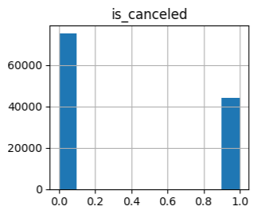
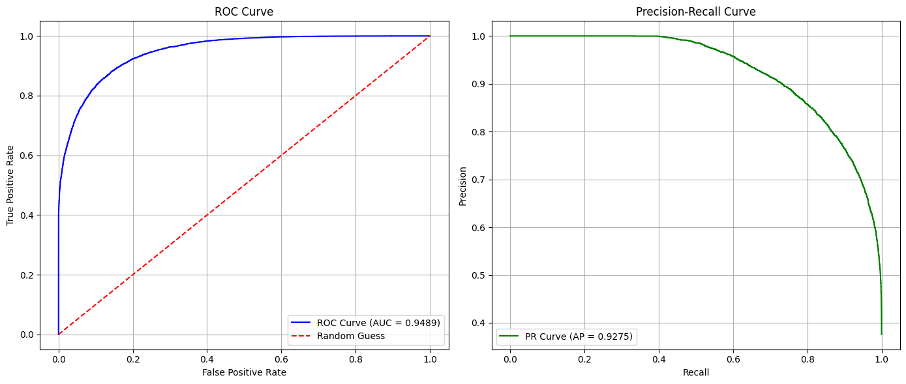

# 호텔 예약 취소 예측 — 모델 학습 보고서

_Hotel Booking Cancellation Prediction · Model Training Report_

> **데이터:** hotel_bookings.csv (전처리 완료본 입력) | **환경:** Google Colab | **프레임워크:** scikit-learn 1.8.0, XGBoost 3.2.0

> **담당 범위:** 모델 학습 · 평가 · 튜닝

----------

## 1. 개요

### 1.1 목표

전처리가 완료된 호텔 예약 데이터를 입력으로 받아, 예약 취소 여부(`is_canceled`)를 예측하는 이진 분류(Binary Classification) 모델을 학습·평가·선정한다. 최종 모델은 호텔 운영 최적화 및 수익 관리(Revenue Management)에 활용된다.

### 1.2 평가 지표 선택 근거

타겟 변수는 유지(0) 약 63%, 취소(1) 약 37%로 클래스 불균형이 존재한다. 

<em>그림. 예약 유지(0)와 예약 취소(1)의 타겟 분포</em>

이 경우 Accuracy만으로 평가하면 다수 클래스에 치우친 판단을 할 수 있어, 다음 지표를 핵심 평가 기준으로 채택하였다.

| 지표 | 설명 |
|---|---|
| Precision | 취소 예측의 정밀도 |
| Recall | 실제 취소 건의 탐지율 |
| F1-Score | Precision / Recall 조화 평균 |
| ROC-AUC | 임계값 독립적 종합 성능 |

----------

## 2. 데이터 분할

학습에 사용한 데이터의 분할 설정은 다음과 같다.

| 구분 | 설정 |
|---|---|
| 학습 : 테스트 | 80 : 20 (`train_test_split`, `random_state=42`, `shuffle=True`) |
| 분할 방식 | 전체 셔플 기반 랜덤 분할 |
| 입력 데이터 | 전처리 완료된 피처셋 (수치형 18 + 범주형 11) |

----------

## 3. 모델 비교 실험

5가지 분류 모델을 동일한 조건으로 학습 및 평가하였다. 정렬 기준은 **ROC-AUC 내림차순**이다.

| 모델 | 주요 하이퍼파라미터 | Accuracy | Precision | Recall | AUC |
|---|---|---:|---:|---:|---:|
| Random Forest | `random_state=42` | 0.8883 | 0.8818 | 0.8115 | **0.9555** |
| XGBoost | `eval_metric=logloss` | 0.8703 | 0.8506 | 0.7944 | 0.9452 |
| Gradient Boosting | `random_state=42` | 0.8424 | 0.8180 | 0.7465 | 0.9219 |
| Logistic Regression | `max_iter=3000`, `random_state=42` | 0.8157 | 0.7910 | 0.6926 | 0.8912 |
| Decision Tree | `random_state=42` | 0.8510 | 0.8001 | 0.8043 | 0.8437 |

> 트리 기반 앙상블(Random Forest, XGBoost)이 상위권을 차지했으며, 그중 **Random Forest가 AUC 0.9555로 가장 우수**하였다.

----------

## 4. 하이퍼파라미터 튜닝

상위 성능 모델인 **Random Forest**와 **XGBoost**에 대해 `GridSearchCV`를 적용하였다.

### 4.1 탐색 파라미터

#### Random Forest

`GridSearchCV(cv=3, scoring='roc_auc', n_jobs=-1)`

| 파라미터 | 탐색 값 |
|---|---|
| `n_estimators` | 100, 200 |
| `max_depth` | 10, 20 |
| `min_samples_split` | 2, 5 |
| `min_samples_leaf` | 2, 4 |

#### XGBoost

`GridSearchCV(cv=3, scoring='roc_auc', n_jobs=-1)`

| 파라미터 | 탐색 값 |
|---|---|
| `n_estimators` | 100, 200 |
| `max_depth` | 3, 5 |
| `learning_rate` | 0.05, 0.1 |

### 4.2 튜닝 결과 요약

| 모델 | Best Params | CV AUC | Test Recall | Test AUC |
|---|---|---:|---:|---:|
| Random Forest | `max_depth=20`, `min_samples_leaf=2`, `min_samples_split=2`, `n_estimators=200` | 0.9423 | 0.7793 | 0.9489 |
| XGBoost | `learning_rate=0.1`, `max_depth=5`, `n_estimators=200` | 0.9331 | 0.7783 | 0.9385 |

----------

## 5. 최종 모델 선정

Test ROC-AUC 최고 점수 기준으로 최종 모델을 자동 선정하였으며, joblib을 통해 pkl로 저장하였다.

-   **선정 기준:** `tuning_result_df` 내 `test_auc` 최댓값
-   **저장 경로:** `/content/drive/MyDrive/2차 프로젝트/best_model.pkl`
-   **최종 선정 모델:** **Random Forest**

### 5.1 최종 모델 평가 곡선

최종 모델에 대해 두 가지 성능 곡선을 생성하여 종합 평가를 수행하였다.

| 곡선 | 설명 | 결과 |
|---|---|---|
| ROC Curve | FPR 대비 TPR 시각화 | **AUC = 0.9489** |
| Precision-Recall Curve | 불균형 클래스에서의 성능 확인 | **AP = 0.9275** |

  
 
<em>그림. 최종 모델 ROC Curve(좌, AUC=0.9489) 및 Precision-Recall Curve(우, AP=0.9275)</em>

ROC-AUC 0.9489는 무작위 예측(0.5) 대비 매우 우수한 분류 성능을 의미하며, 클래스 불균형 상황에서도 PR-AUC(AP) 0.9275로 높은 정밀도-재현율 균형을 유지하였다.

----------

## 6. 결론

-   5가지 분류 모델을 동일 조건으로 비교한 결과, 트리 기반 앙상블(Random Forest, XGBoost)이 우수한 성능을 보였다.
- 하이퍼파라미터 튜닝을 거쳐 **Random Forest를 최종 모델로 선정**하였으며, **Test AUC 0.9489 / AP 0.9275**를 달성하였다.
-   불균형 데이터 특성을 고려해 ROC-AUC와 PR-AUC를 함께 평가함으로써, 소수 클래스(취소)에 대한 성능도 안정적임을 확인하였다.

----------

## 7. 실험 환경

| 항목 | 내용 |
|---|---|
| 실행 환경 | Google Colab |
| Python | 3.12.13 (Colab 기본) |
| scikit-learn | 1.8.0 |
| XGBoost | 3.2.0 |
| 데이터 저장소 | Google Drive (`/content/drive/MyDrive/2차 프로젝트/`) |
| 모델 저장 형식 | joblib (`.pkl`) |
| 문서 작성 형식 | Markdown |
